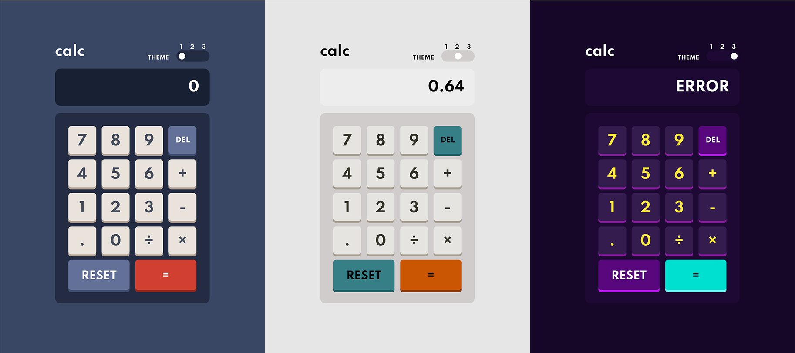

# Calculator App

This is my solution to the [Calculator Project on The Odin Project](https://www.theodinproject.com/paths/foundations/courses/foundations/lessons/calculator) via [Calculator app challenge on Frontend Mentor](https://www.frontendmentor.io/challenges/calculator-app-9lteq5N29).

## Table of contents

- [Calculator App](#calculator-app)
  - [Table of contents](#table-of-contents)
  - [Overview](#overview)
    - [The goals](#the-goals)
    - [Screenshot](#screenshot)
    - [Links](#links)
  - [My process](#my-process)
    - [Built with](#built-with)
    - [What I learned](#what-i-learned)
    - [Continued development](#continued-development)
    - [Useful resources](#useful-resources)
  - [Author](#author)

## Overview

### The goals

- Perform mathmatical operations like addition, subtraction, multiplication, and division
- Adjust the color theme based on user preference
- Users can get floating point numbers

### Screenshot



### Links

- [View code solution](https://github.com/minhlong149/calculator-app/)
- [Live site preview](https://minhlong149.github.io/calculator-app/)

## My process

### Built with

- Semantic HTML5 markup
- CSS Flexbox, Grid & Custom properties
- Vanila JavaScripts

### What I learned

- Create a clickable button, with box shadow that disappear when clicked.

```css
.key {
  box-shadow: 0 0.15rem #000;
}

.key:active {
  box-shadow: none;
  transform: translateY(0.15rem);
}
```

### Continued development

- Add keyboard support

### Useful resources

- [CSS-Tricks' Guide to Grid](https://css-tricks.com/snippets/css/complete-guide-grid/) - This helped me to layout the keyboard. I really liked this pattern and will use it going forward.
- [Fireship' Video on CSS Theme Switcher](https://youtu.be/rXuHGLzSmSE?t=313) w/ CSS variables and JavaScript.
- [Karim Merchant' Medium Post on Calculator UI](https://www.example.com) - I'd recommend it to anyone want to learn more about this concept.

## Author

- Github - [Long Nguyen](https://github.com/minhlong149)